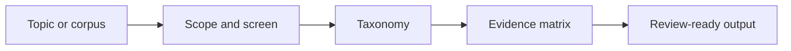

# Literature Review Workflow Skill

Portable end-to-end literature review skill for scope setting, corpus building, taxonomy design, evidence extraction, and review deliverable preparation.

## Who This Is For

| Use this when you... | Use something else when you... |
| --- | --- |
| need an end-to-end literature review workflow | only need one paper section explained |
| want a taxonomy, comparison matrix, or review-ready synthesis | only want bibliography cleanup |
| need upstream review content before a deck or report | need slide visuals without review synthesis |

## Why This Exists

- Keeps literature review work evidence-first and corpus-aware.
- Separates review synthesis from later presentation or poster authoring.
- Provides stable intermediate artifacts for long reviews.

## What Ships

| Component | Role |
| --- | --- |
| [`literature-review-workflow`](./literature-review-workflow) | installable Codex App skill package |
| [`literature-review-workflow/agents/openai.yaml`](./literature-review-workflow/agents/openai.yaml) | Codex App interface metadata |
| [`literature-review-workflow/references`](./literature-review-workflow/references) | bundled public reference material |
| [`literature-review-workflow/scripts`](./literature-review-workflow/scripts) | bundled helper scripts |
| [`literature-review-workflow/test-prompts.json`](./literature-review-workflow/test-prompts.json) | trigger and non-trigger examples |
| [`literature-review-workflow/review`](./literature-review-workflow/review) | nested review-writing skill |
| [`CHANGELOG.md`](./CHANGELOG.md) | release history |
| [`LICENSE`](./LICENSE) | license |

## Install / Use

### Codex App

- Install the skill from this repo path: `literature-review-workflow`
- GitHub install target:
  - repo: `Mingdao007/literature-review-workflow-skill`
  - path: `literature-review-workflow`
- Restart `Codex App` after installation so the new skill is discovered.

## Workflow

## Coverage

- scope note, corpus log, taxonomy, and comparison-matrix workflow
- anchor-paper driven synthesis before report or deck authoring
- structured templates for review notes, source logs, and slide outlines

## Expected Result / Verification

| Check | Expected result |
| --- | --- |
| Install target | `literature-review-workflow` |
| GitHub target | `Mingdao007/literature-review-workflow-skill` with path `literature-review-workflow` |
| Skill entrypoint | `literature-review-workflow/SKILL.md` exists |
| Trigger examples | `literature-review-workflow/test-prompts.json` |
| Privacy check | public package contains no private local paths or live user state |

## Trigger Examples

- `Run a literature review on this topic.`
- `Build a taxonomy and comparison matrix for these papers.`
- `Prepare review-ready content from a paper corpus.`

## Non-Trigger Examples

- `Explain only one paper section.`
- `Only clean my bibliography database.`
- `Design slide visuals without doing the review workflow.`

## Privacy Boundary

This public repository keeps the workflow generic and reusable.

- User-specific defaults and local note conventions are rewritten into generic public defaults.
- The public package does not depend on private memory files or local reference-manager setup.

## Repository Layout

| Path | Purpose |
| --- | --- |
| [`literature-review-workflow`](./literature-review-workflow) | installable Codex App skill package |
| [`literature-review-workflow/agents/openai.yaml`](./literature-review-workflow/agents/openai.yaml) | Codex App interface metadata |
| [`literature-review-workflow/references`](./literature-review-workflow/references) | bundled public reference material |
| [`literature-review-workflow/scripts`](./literature-review-workflow/scripts) | bundled helper scripts |
| [`literature-review-workflow/test-prompts.json`](./literature-review-workflow/test-prompts.json) | trigger and non-trigger examples |
| [`literature-review-workflow/review`](./literature-review-workflow/review) | nested review-writing skill |
| [`CHANGELOG.md`](./CHANGELOG.md) | release history |
| [`LICENSE`](./LICENSE) | license |

Chinese:

- [README.zh-CN.md](./README.zh-CN.md)
