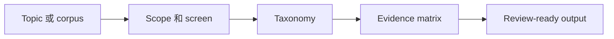

# Literature Review Workflow Skill

可移植的端到端 literature review skill，用于 scope setting、corpus building、taxonomy design、evidence extraction 和 review deliverable preparation。

## 适合谁

| 适合使用 | 不适合使用 |
| --- | --- |
| 需要端到端 literature review workflow | 只解释一篇 paper 的某一节 |
| 需要 taxonomy、comparison matrix 或 review-ready synthesis | 只清理 bibliography |
| 在做 deck/report 前需要上游 review content | 只做 slide visual，不做 review synthesis |

## 为什么需要它

- 让 literature review 保持 evidence-first 和 corpus-aware。
- 把 review synthesis 与之后的 presentation/poster authoring 分开。
- 为长周期 review 提供稳定中间 artifacts。

## 包含内容

| Component | 作用 |
| --- | --- |
| [`literature-review-workflow`](./literature-review-workflow) | 可安装的 Codex App skill package |
| [`literature-review-workflow/agents/openai.yaml`](./literature-review-workflow/agents/openai.yaml) | Codex App 界面 metadata |
| [`literature-review-workflow/references`](./literature-review-workflow/references) | 随包发布的公开 reference material |
| [`literature-review-workflow/scripts`](./literature-review-workflow/scripts) | 随包发布的 helper scripts |
| [`literature-review-workflow/test-prompts.json`](./literature-review-workflow/test-prompts.json) | trigger / non-trigger 示例 |
| [`literature-review-workflow/review`](./literature-review-workflow/review) | 嵌套 review-writing skill |
| [`CHANGELOG.md`](./CHANGELOG.md) | release history |
| [`LICENSE`](./LICENSE) | license |

## 安装 / 使用

### Codex App

- 从本 repo 的这个路径安装 skill：`literature-review-workflow`
- GitHub install target:
  - repo: `Mingdao007/literature-review-workflow-skill`
  - path: `literature-review-workflow`
- 安装后重启 `Codex App`，让新 skill 被重新发现。

## 工作流

## 覆盖范围

- scope note、corpus log、taxonomy 和 comparison-matrix workflow
- report/deck authoring 前基于 anchor paper 的 synthesis
- review notes、source logs 和 slide outlines 的结构化模板

## 预期结果 / 验证

| 检查项 | 预期结果 |
| --- | --- |
| 安装路径 | `literature-review-workflow` |
| GitHub target | `Mingdao007/literature-review-workflow-skill`，path 为 `literature-review-workflow` |
| Skill 入口 | 存在 `literature-review-workflow/SKILL.md` |
| 触发样例 | `literature-review-workflow/test-prompts.json` |
| 隐私检查 | 公开包不包含私人本机路径或 live user state |

## 触发示例

- `Run a literature review on this topic.`
- `Build a taxonomy and comparison matrix for these papers.`
- `Prepare review-ready content from a paper corpus.`

## 不应触发

- `Explain only one paper section.`
- `Only clean my bibliography database.`
- `Design slide visuals without doing the review workflow.`

## 隐私边界

这个公开仓库只保留通用、可复用的 workflow。

- user-specific defaults 和本地 note convention 已改写为通用 public defaults。
- 公开包不依赖 private memory files 或本地 reference-manager setup。

## 仓库结构

| 路径 | 作用 |
| --- | --- |
| [`literature-review-workflow`](./literature-review-workflow) | 可安装的 Codex App skill package |
| [`literature-review-workflow/agents/openai.yaml`](./literature-review-workflow/agents/openai.yaml) | Codex App 界面 metadata |
| [`literature-review-workflow/references`](./literature-review-workflow/references) | 随包发布的公开 reference material |
| [`literature-review-workflow/scripts`](./literature-review-workflow/scripts) | 随包发布的 helper scripts |
| [`literature-review-workflow/test-prompts.json`](./literature-review-workflow/test-prompts.json) | trigger / non-trigger 示例 |
| [`literature-review-workflow/review`](./literature-review-workflow/review) | 嵌套 review-writing skill |
| [`CHANGELOG.md`](./CHANGELOG.md) | release history |
| [`LICENSE`](./LICENSE) | license |

English:

- [README.md](./README.md)
